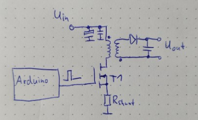
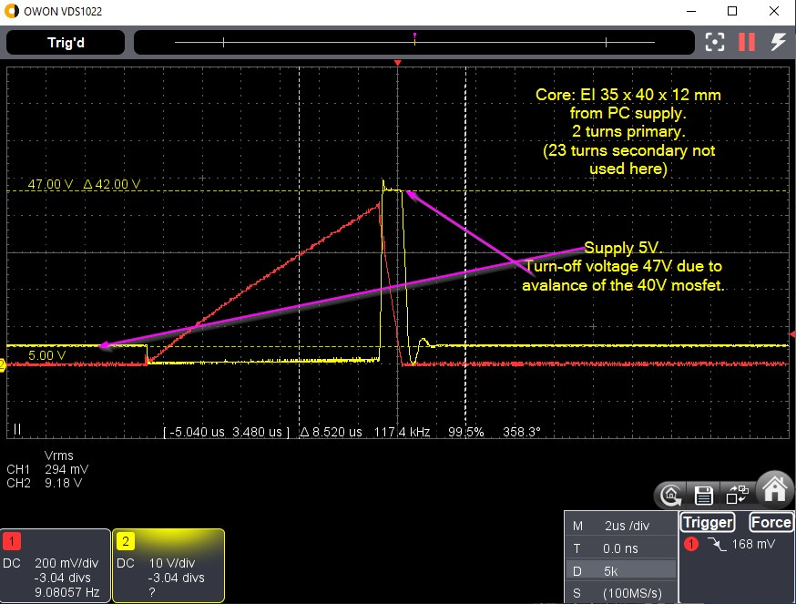
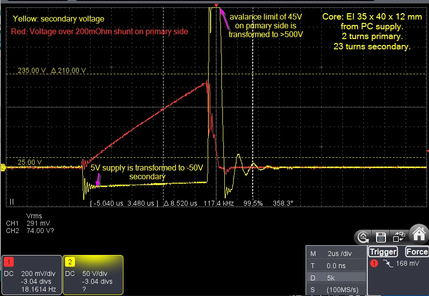
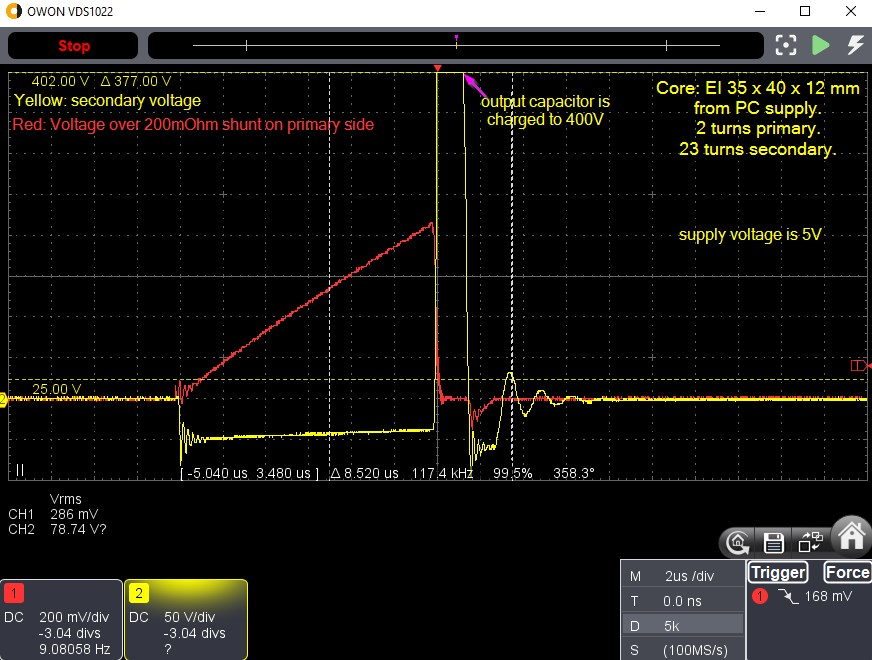
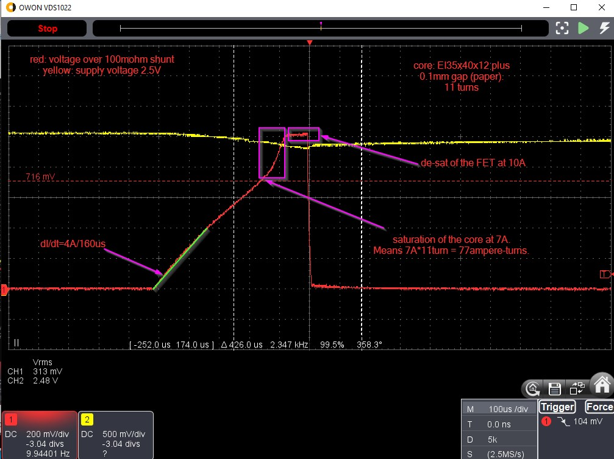
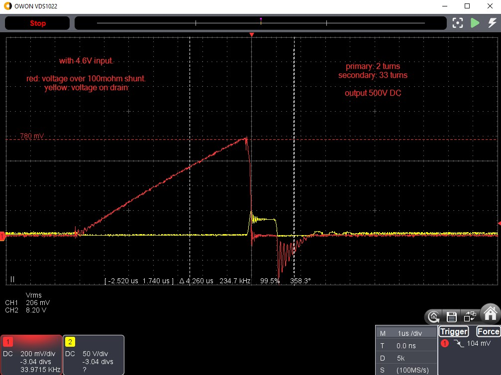
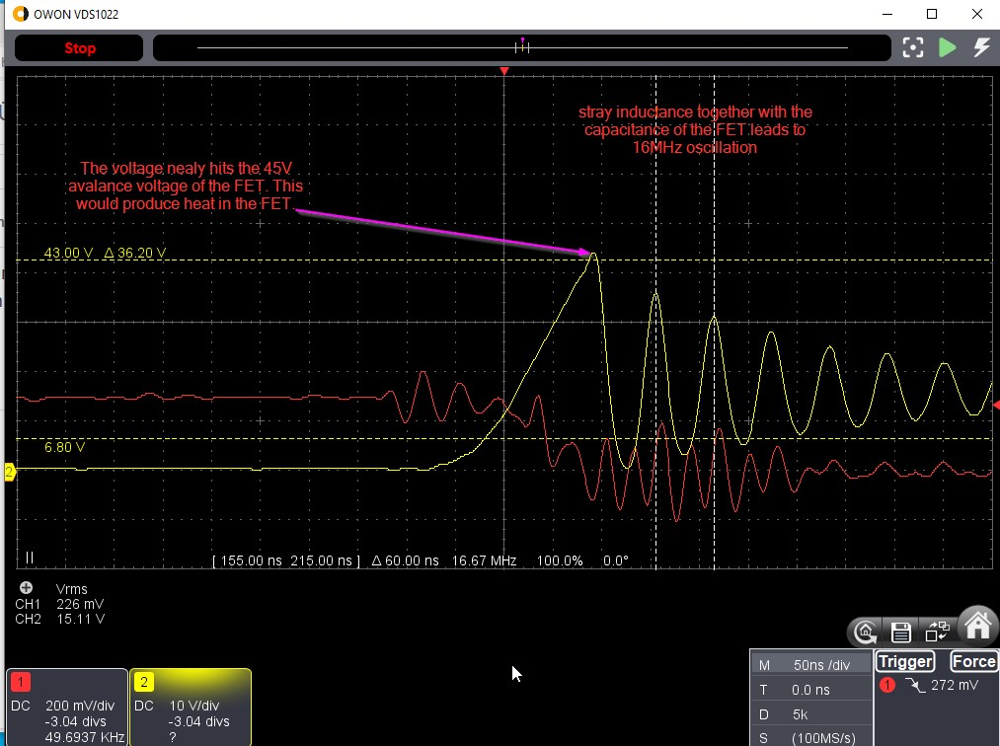
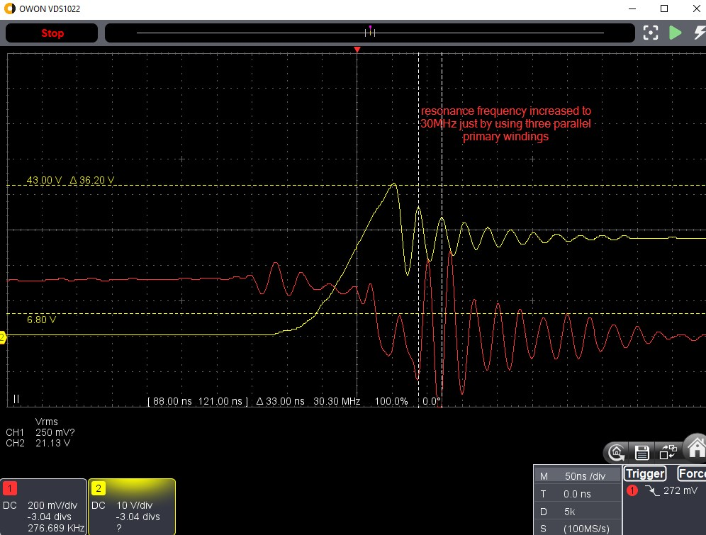

# Step-Up-Converter experiments

## Level 1: A basic small step-up design

The inductivity L can be determined by the steepness of the current while the voltage is constant: L = U / (dI/dt).

L = 2V / (1.5A / 380µs) = 506µVs/A = 506µH

The stored energy is E = 1/2 * L * I^2.

E_sat = 1/2 * 506µVs/A * 1.5A * 1.5A = 570 µVAs = 0.57mWs

Output with no load

Output with D and C

## Level 2: Increasing the air gap increases the stored energy

Putting a 0.1mm paper stripe between the E and the I of the core.

The stored energy is E = 1/2 * L * I^2.

The inductivity L can be determined by the steepness of the current while the voltage is constant: L = U / (dI/dt).
L= 2.5V / (4A / 160µs) = 100 µVs/A = 100µH

E_sat = 1/2 * 100µVs/A * 7A * 7A = 2450µVAs = 2.45mWs

Conclusion: Adding 0.1mm air gap to the core increases the storable energy from 0.6mJ to 2.5mJ. In parallel, the inductance decreases by factor 5, which leads to a steeper current ramp, this means that the maximum energy is reached nearly at the same time (around 400µs at ~2.5V supply).

## Level 3: More output voltage

* N1=2, N2=33
* t_on=7µs, t_off=22µs
* R_load=100k
* U_in=4,6V, I_in=1A, P_in=4.6W
* U_out=500V, I_out=5mA, P_out=2.5W

Limiting factors regarding more output power:
- (The 100k load resistor needs to be able to dissipate more power)
- The 7µs on-time nearly leads to de-saturation of the FET due to rising voltage on the shunt. A lower shunt resistance will fix this. This measure will also increase the efficiency.

## Level 4: Fixing the shunt and load

* Shunt decreased to 50 mOhm (consisting of 20 x 1 ohm).
* Load resistor 8*12k + 3k9

With this setup we get easily 500V DC, which is 2.5W output without smoke.
The limiting element when increasing the input voltage further, is now the FET, which runs into avalance due the stray inductance, and produces heat until it de-solders. (auto-protecting ;-)

## Level 5: The stray inductance

For N1 we use instead of one now three windings in parallel, distributed over the core, to reduce the stray inductance. With this measure, the resonance frequency in the turn-off phase increases from 16 MHz to 30 MHz.

Nevertheless, the voltage spike at turn-off of the FET nearly reaches the avalance voltage, which
would produce a lot of heat if the voltage is further increased.

How to avoid the large stray-inductance-caused-oscillation?
Some ideas are mentioned here: https://www.joretronik.de/Web_NT_Buch/Kap9/Kapitel9.html

* 10nF + 10 ohms over the primary winding dampens the 30MHz quite well.
* additionally, D + (100nF || 12kohm) flattens the initial spike a little bit. D is a 1N5822.

Result details in Excel. Summary: ~55% efficiency. >4W output reached.

## References

https://www.joretronik.de/Web_NT_Buch/Kap7_2/Kapitel7_2.html
